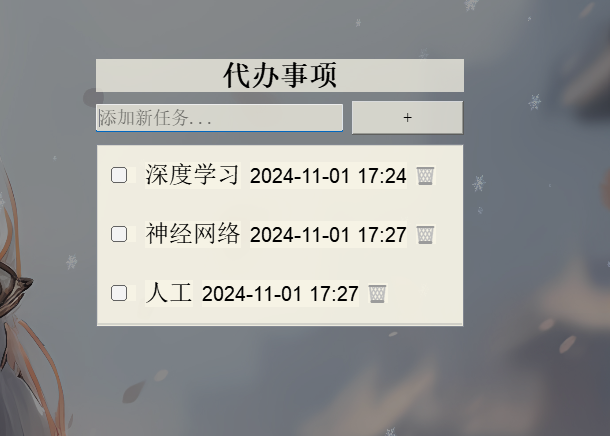

```markdown
# 代办事项应用程序

该应用程序是一个简单的代办事项列表工具，使用 Python 和 PyQt5 开发。它允许您管理任务、添加时间戳，并将应用程序最小化到系统托盘中显示自定义图标。

## 功能

- **添加任务**：轻松添加新任务，并自动记录添加时间。
- **管理任务**：标记任务完成、删除任务，查看所有任务。
- **系统托盘图标**：应用程序可以最小化到系统托盘中，并通过托盘图标管理任务。
- **自动保存**：任务保存在 `tasks.json` 文件中，下次启动应用时自动加载。
- **透明窗口**：应用窗口是半透明的，并且可以拖动。

## 依赖

- Python 3.x
- PyQt5
- PyStray
- PIL (Python Imaging Library)

使用以下命令安装所需的库：

```bash
pip install -r requestments.txt
```

## 文件说明

- `main.py`：主程序文件，运行此脚本启动代办事项应用。
- `tasks.json`：用于保存任务的 JSON 数据文件。
- `代办.png`：自定义的系统托盘图标。
- `效果图.png`：应用程序界面示例截图。

## 使用教程

1. **运行应用程序**  
   执行以下命令运行代办事项应用：

   ```bash
   python main.py
   ```

2. **添加任务**  
   - 在输入框中输入任务描述。
   - 点击 `+` 按钮将任务添加到列表中。
   - 每个任务将显示添加时的日期和时间。

3. **完成或删除任务**  
   - 勾选任务旁边的复选框来标记任务完成。
   - 点击任务旁的 🗑️（垃圾桶）图标删除任务。

4. **系统托盘图标**  
   - 点击关闭按钮将应用最小化到系统托盘（应用不会退出，而是隐藏到托盘中）。
   - 在系统托盘中右键托盘图标可进行以下操作：
     - **显示**：打开主应用窗口。
     - **显示任务**：弹出当前任务列表的通知。
     - **退出**：彻底关闭应用程序。

5. **窗口拖动**  
   - 在应用背景区域按住鼠标并拖动可以移动窗口位置。

## 自定义

- **图标**：用您自己的 PNG 图像替换 `代办.png`，以自定义系统托盘图标。
- **任务文件**：在 `main.py` 中修改 `tasks.json` 的路径，可以将任务保存在其他位置。

## 截图



## 注意

- 应用程序最小化到系统托盘后会在后台运行。
- 如果 `tasks.json` 文件缺失或损坏，应用将以空的任务列表启动。
```